## **Machine Learning for Retail Chains: Developing Predictive and Forecasting Models and Api for Retail Revenue.**

### **<u>Project Overview</u>**

The project involves working with an American retail chain operating
across California (CA), Texas (TX), and Wisconsin (WI). This retailer
offers a diverse range of products, including hobbies, foods, and
household items, across ten stores. The objective is to develop and
deploy two distinct machine learning models as APIs with an aims to
address two specific business challenges:

1\. Predictive Model: A machine learning model to predict sales revenue
for specific items in particular stores on given dates.

2\. Forecasting Model: A time-series-based model to forecast total sales
revenue across all stores and items for the next seven days.

These models will help optimize inventory, pricing, and decision-making
for our retail partner.

### **<u>Business Problem</u>**

The primary business problems that the machine learning models aim to
address are:

1\. Revenue Prediction: The retailer needs to accurately predict the
sales revenue for individual items in specific stores on any given date.
This helps in optimizing inventory levels and pricing strategies.

2\. Revenue Forecasting: The retailer seeks to forecast total sales
revenue across all stores and items for the next seven days. This
provides valuable insights for business planning and resource
allocation.

The machine learning models aim to address these business challenges by
providing precise predictions and forecasts.

### **Tasks:**

Below 2 models are built for this task.

-   **Predictive XGBoost Model**

-   **Forecasting Prophet Model**

### **<u>Datasets</u>**

The dataset consists of historical sales and revenue data from an.
American based retail business. It includes information on various
aspects, such as dates, store locations, item categories, and daily
sales spanning across separate CSV files. This dataset serves as the
foundation for building predictive and forecasting models to aid in
inventory management and pricing strategies.

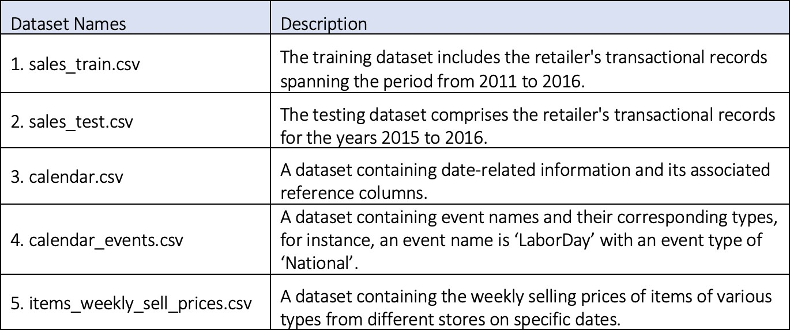

**<u>Data Limitations:</u>**

-   **Lack of Metadata**: The dataset lacks metadata or detailed
    descriptions of variables and their meanings. This limitation
    required relying on domain knowledge or making anticipations, which
    can introduce uncertainty into the analysis.

-   **Limited Store and State Coverage**: The dataset only includes
    weekly sell prices for items from two stores, CA\_1 and CA\_2, out
    of a total of 10 stores spanning three different states. This
    limited coverage may raise concerns about data completeness and
    generalizability to the broader retail environment.

-   **Unique Identifiers**: The presence of unique identifiers, such as
    product IDs, in the data can pose a challenge. These identifiers may
    lead to overfitting if not handled carefully. Overfitting occurs
    when a model learns to memorize specific data points rather than
    identifying general patterns, which can result in poor predictive
    performance on new data.

-   **Ethical Considerations**: It is essential to consider ethical data
    limitations, particularly when handling transactional data. This
    includes ensuring that customer privacy is respected, and that data
    usage complies with relevant regulations and guidelines.

Addressing these limitations through appropriate data preprocessing,
feature selection, and model training techniques is crucial for building
a robust and reliable revenue prediction model.

### **<u>Data Preparation</u>**

To ensure the quality of the data for modelling, conducted the below activities.

-   **Reshaping the training dataset and renaming the attributes**.

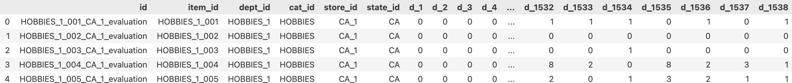

The above training dataset had columns named from d\_1 to d\_1541 representing the sold item volume for each day for distinct items from 10 stores across 3 separate states. So, melt functionality was utilized to reshape the data to improve attribute organization and for more convenient and suitable data analysis and modelling task.

Additionally, the 'd\_\*' column was relabeled as 'dayofsale,' and the 'sold item numbers' were renamed as 'volume.

-   **Combining the individual datasets into a single dataset**.

> 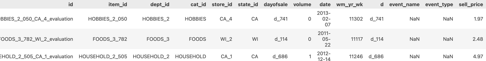 style="width:5.96096in;height:0.75906in" />

Combining data from various sources into a single data frame is a fundamental step in data preprocessing for modelling. It ensures data consistency, enables feature engineering, and simplifies the overall analysis process, ultimately contributing to better decision-making and model performance.

-   **Feature Engineering**.

<!-- -->

-   Computing the total revenue based on the items sold and the weekly
    price of an item:

    -   Calculating the overall revenue by considering the number of
        items sold and their corresponding weekly prices was essential
        for developing the machine learning model to predict target
        variable revenue.

-   Processing the ‘date’ feature to derive additional date related
    information

    -   To enhance the dataset's date related information by extracting
        additional date related features from the 'date' attribute such
        as day of a week, month, year, and week of the year for a model
        to learn generalized features.

    -   Therefore, set the datetime type to the date feature and
        utilized the datetime functionality to extract the day of the
        week, month, year, and week of the year information.

<!-- -->

-   **Selecting appropriate features**.

Features selected: 'item\_id', 'store\_id', 'date', 'event\_name', 'event\_type', 'revenue'

To build a machine learning predictive model, above specific features were chosen. Due to the presence of duplicate columns after aggregating the datasets, it resulted in the large dataset leading to memory related issues. For instance, ‘store\_id’ field values (CA\_1, WI\_2, TX\_9) already incorporates the ‘state\_id’ attribute values (CA, WI, TX). Therefore, it's logical to choose pertinent features that have generalized unique values and avoid duplicates.

Additionally, to address the memory challenges associated with analyzing the extensive dataset, the above mentioned features were chosen based on their relevance from a business perspective.

-   **Identifying and eliminating identifiers**.

The 'id' attributes serve as unique identifiers for individual items
sold within a specific category, store, and state on a particular date.
As a result, during the feature selection process, this identifier was
omitted.

Including it in the analysis could potentially result in overfitting,
where the model becomes too focused to these specific values, rather
than capturing the underlying, generalized patterns present in the
retailer's data.

-   **Splitting data into different datasets**.

To split the dataset into training and validation below strategy was
employed.

> \- Training data: From 2011-01-01 to 2014-12-31
>
> \- Validation data: from 2015-01-01 to 2016-12-31

The retail data covers multiple years, and splitting it into training
(historical) and validation (future) sets, would maintain the temporal
consistency of the dataset. This ensures that the model is trained on
past data and tested on more recent data, mimicking a real-world
scenario.

Furthermore, this approach aided in handling the relatively compact
dataset, mitigating memory-related challenges.

-   **Handling and imputing missing values**.

After combining the datasets, missing values were identified in the attributes.

<table>
<colgroup>
<col style="width: 46%" />
<col style="width: 53%" />
</colgroup>
<thead>
<tr>
<th>Attribute Name</th>
<th>Total missing values</th>
</tr>
</thead>
<tbody>
<tr>
<td>event_name</td>
<td>43143350</td>
</tr>
<tr>
<td>event_type</td>
<td>43143350</td>
</tr>
<tr>
<td>revenue</td>
<td>12291876</td>
</tr>
</tbody>
</table>

To handle missing values in the 'event\_name' and 'event\_type' features, 'None' was used as a replacement for the missing values.

For address missing values in the 'revenue' target feature, 0 was used for imputation. This signifies days with no items sold and, consequently, zero income.

-   **Aggregating the revenues based on the date across all items,
    stores, and states**.

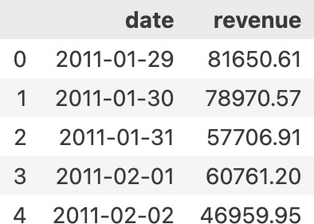

To construct the revenue forecasting model using the Prophet time-series
model, aggregated the revenue figures based on the date, encompassing
all items, stores, and states.

### **<u>Modelling</u>**

As a part of the learning process, developed and trained the following
regression and time-series models.

-   **Predictive Model**

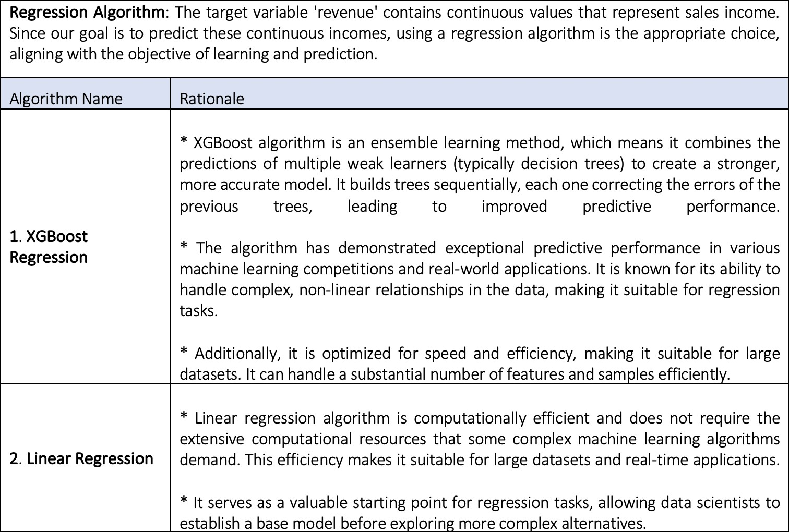

Pipeline

The pipeline automates the steps required to preprocess input data, and
make predictions as the same preprocessing and prediction steps are
consistently applied to incoming data, ensuring that results are
reproducible and dependable.

Building a pipeline for model deployment for servicing with an API
enhances the model's usability and reliability in using the predictive
model in an operational environment.

-   **Forecasting Model**

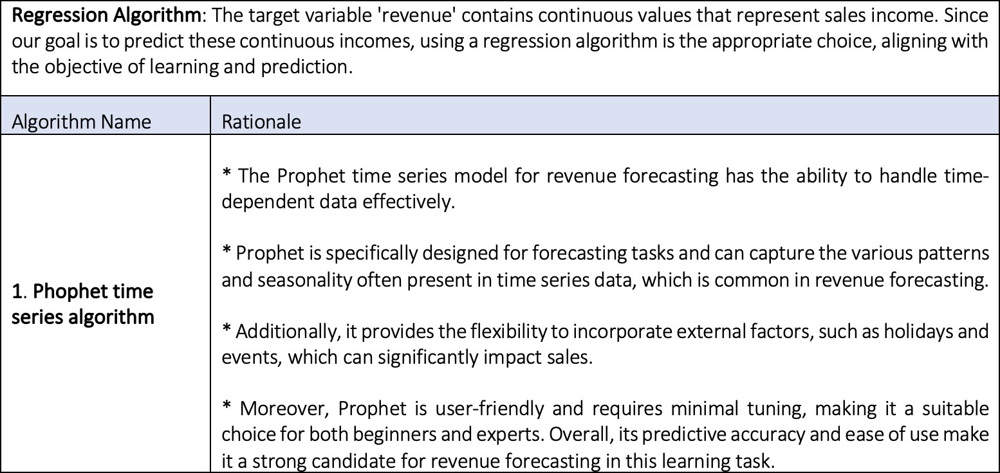

Employing Holiday Construct of the Phophet algorithm.

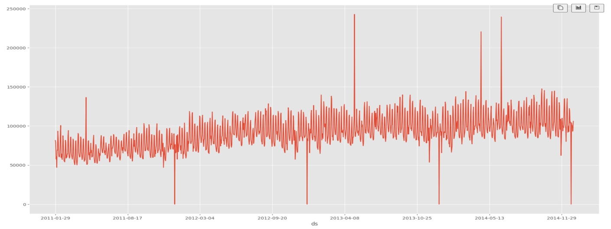

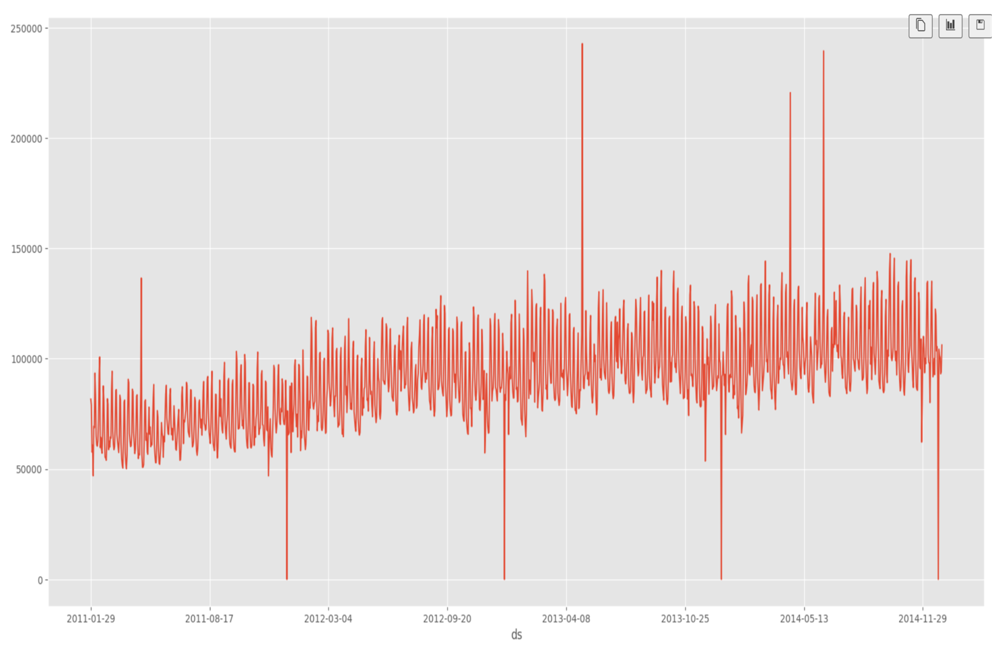

The charts above demonstrate periodic spikes in retail revenue in both directions, with noticeable increases and declines occurring during specific months of the year, following a recurring pattern at certain intervals.

While these spikes could be attributed to various factors, we can hypothesize that they may be related to long weekends, holidays, or significant promotions that the company runs approximately every quarter, potentially impacting the sales revenue.

To leverage this information for more accurate forecasting during those months, utilizing Prophet's holiday feature which is a Pandas dataframe containing the holidays and their respective date.

## **<u>Evaluation:</u>**

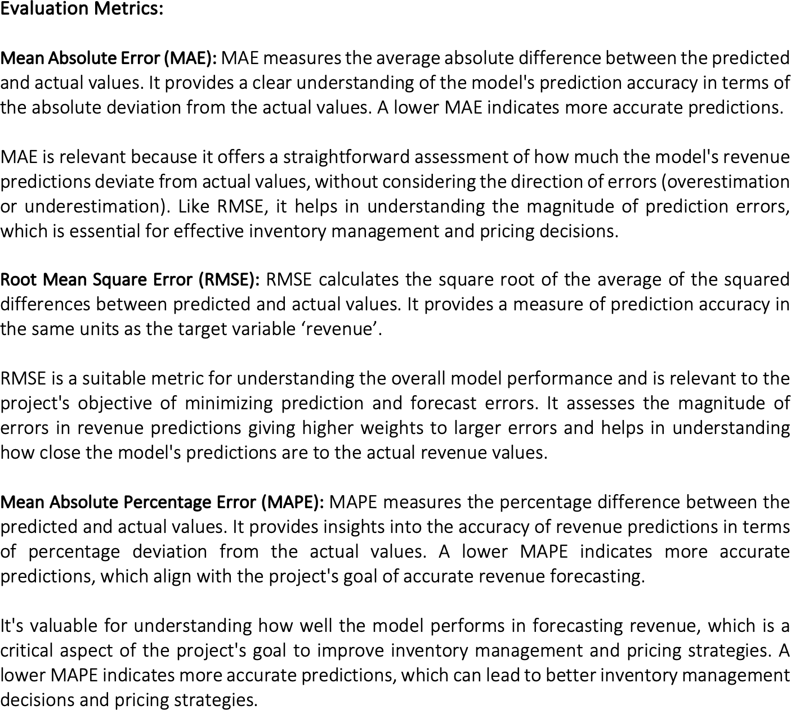

### **Results and Analysis:**

-   **Predictive Model**
    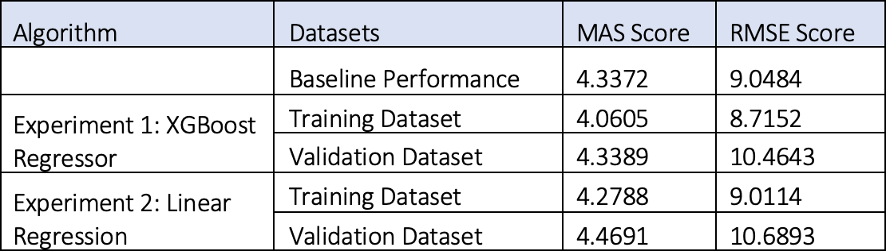

The baseline model has a MAS score of 4.3372 and an RMSE score of 9.0484. This serves as a reference point for evaluating the other models.

Experiment 1: XGBoost Regressor

-   The XGBoost Regressor algorithm achieves a lower MAS score (4.0605)
    and RMSE score (8.7152) compared to the baseline on the training
    data. This indicates that the model provides a better fit to the
    training dataset.

-   However, the model’s performance on the validation dataset,
    deteriorates slightly, with a slightly higher MAS score (4.3389) and
    considerably higher RMSE score (10.4643), suggesting that the model
    is overfitting to the training dataset, as it struggles to
    generalize to unseen data.

Experiment 2: Linear Regression

-   The Linear Regression model has a MAS score of 4.2788 and an RMSE
    score of 9.0114 on the training dataset. It performs slightly worse
    than the XGBoost Regressor but is still better than the baseline.

-   On the validation dataset, the model has a higher MAS score (4.4691)
    and RMSE score (10.6893) compared to the XGBoost Regressor. Similar
    to XGBoost model, it also overfitts on the training dataset.

<!-- -->

-   **Forecasting Model**

> 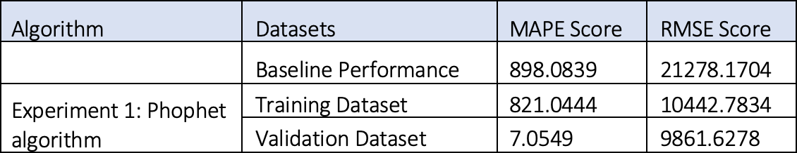 style="width:5.5112in;height:0.97646in" />

The baseline model's MAPE score of 898.0839 indicates that, on average,
it predicted sales revenue values with an error of approximately 898%.

The RMSE score of 21278.1704 represents the root mean square error,
which measures the square root of the average squared differences
between the predicted and actual revenue values. This score is
exceptionally elevated, suggesting a significant spread of errors in the
baseline model's revenue forecasts.

Experiment 1: Phophet algorithm

-   The Prophet algorithm’s, MAPE score on the training dataset reduced
    to 821.0444, indicating that the Prophet algorithm reduced the
    average prediction error by a significant margin.

-   The RMSE score in the training dataset decreased to 10442.7834,
    signifying a substantial reduction in prediction errors' dispersion.

-   The validation dataset showed remarkable results, with an
    exceptionally low MAPE score of 7.0549. This indicates that, on
    average, the Prophet algorithm’s predictions deviated by only about
    7% from the actual sales revenue values, demonstrating high
    accuracy.

-   The RMSE score in the validation dataset further decreased to
    9861.6278, highlighting the effectiveness of the Prophet algorithm
    in reducing errors in revenue predictions.

Therefore, when evaluating the performance metrics, the predictive model
using the XGBoost algorithm, from Experiment 1 indicates slightly
superior performance compared to linear regression. It not only
outperforms the other models but also exceeds the baseline performance.

As a result, the XGBoost model is selected for model deployment, and the
pipeline is constructed using the XGBoost model, while for forecasting,
the trained Prophet algorithm was employed as part of the forecasting
service via an API.

### **<u>Models Summary and Business Impact and Benefits:</u>**

-   **Predictive Model**

The XGBoost Regressor model from experiment 1 outperforms the Linear
Regression model although it also exhibits overfitting issues. This
suggests that the models may have learned specific patterns in the
training dataset that do not generalize well to new, unseen data. The
impact of overfitting is that the models may make less accurate
predictions while servicing in real-world scenarios.

The root causes of model performance issues, such as overfitting, need
further investigation. It could be due to insufficient data, or data
transformation choices like ordinal encoder. Identifying and addressing
these root causes is critical for improving model performance and
business outcomes.

Additionally, incorrect predictions can have various impacts on the
business such as overstocking or understocking of products, affecting
inventory management efficiency, suboptimal pricing decisions, affecting
profitability and inefficiencies in staffing and supply chain
management.

-   **Forecasting Model**

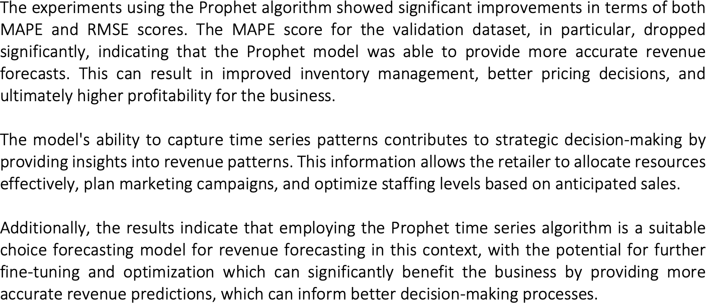

Below are a few risks from a business point of view.

-   Overfitting: One of the primary business risks is overfitting, where
    the model performs exceptionally well on the training data but
    struggles to generalize to new, unseen data. In the context of
    revenue prediction, overfitting could lead to inaccurate forecasts
    when applied to real-world sales data.

-   Model Robustness: Business conditions can change over time, and the
    model should continue to deliver accurate forecasts as market
    dynamics evolve.

-   Data Quality: Another significant business risk is the quality of
    the data used for training and prediction. Inaccurate, incomplete,
    or biased data can adversely affect the model's predictions.

-   Privacy Concerns: Businesses must handle customer and sales data
    ethically and in compliance with privacy regulations. Failure to do
    so can result in legal and reputational issues.

Below are some essential recommendations for the retail business.

-   Invest in Data Quality Assurance: Address any data anomalies or
    inconsistencies promptly to prevent them from affecting predictive
    models.

-   Enhance Data Privacy and Compliance: Implement data encryption,
    access controls, and auditing to protect sensitive information.

-   Continuous Model Monitoring and Improvement: Establish a system for
    ongoing model monitoring and performance evaluation.

-   Incorporate External Data Sources: Incorporate relevant data that
    can provide insights into market trends and potential sales drivers.

-   Ethical AI and Fairness: Establish guidelines for the responsible
    use of predictive models, including ethical considerations.

### **<u>Data Privacy and Ethical Concerns:</u>**

-   As the dataset was procured from a university portal for academic
    purposes, there were no apprehensions related to copyright or
    privacy infringements.

-   Lack of transparency in pricing algorithms can lead to hidden
    markups or discriminatory pricing. So, it is essential to make
    pricing algorithms transparent, ensuring customers understand how
    prices are determined.

-   Biased data can lead to unfair predictions, such as discriminatory
    pricing or targeting. This can harm certain customer groups. So
    regularly audit data for bias, correct imbalances, and employ
    fairness-aware algorithms to ensure equitable outcomes.

-   Retail businesses collect customer data for various purposes,
    including sales forecasting. There's a risk of privacy breaches and
    data misuse. Therefore, implement strong data encryption, access
    controls, and anonymization techniques.

### **<u>Conclusion</u>**

In conclusion, this project aimed to develop predictive (XGBoost) and
forecasting (Phophet) models for sales revenue in a retail setting.
Models were successfully deployed as APIs, providing real-time
predictions and forecasts to enhance the overall retail business profits
and success.

The project achieved its primary goal by delivering predictive and
forecasting models for sales revenue. Stakeholder requirements,
including those of retail managers and pricing analysts, were met with
user-friendly interfaces providing real-time predictions and forecasts
to enhance the overall retail business profits and success.

Further, I would experiment with the XGBoost regressor with
hyperparameters like max\_depth, subsample, max\_leaves etc. to improve
their predictive performance for better model generalization. And
explore other time series models namely SARIMA.

### **Prerequisites**

-   Python 3.7+
-	numpy
-	pandas
-	scikit-learn
-	pickleshare
-	plotly
-	cmdstanpy
-	fastapi
-	uvicorn
-	joblib
-	prophet
-	xgboost

• The structure of the project directory is as below.

<small>Project based on the <a target="_blank" href="https://drivendata.github.io/cookiecutter-data-science/">cookiecutter data science project template</a>. #cookiecutterdatascience</small>

Project Organization
------------

    ├── LICENSE
    ├── Makefile           <- Makefile with commands like `make data` or `make train`
    ├── README.md          <- The top-level README for developers using this project.
    ├── data
    │   ├── external       <- Data from third party sources.
    │   ├── interim        <- Intermediate data that has been transformed.
    │   ├── processed      <- The final, canonical data sets for modeling.
    │   └── raw            <- The original, immutable data dump.
    │
    ├── api_service        <- An API service for predicting revenue in retail stores
    │
    ├── docs               <- A default Sphinx project; see sphinx-doc.org for details
    │
    ├── models             <- Trained and serialized models, model predictions, or model summaries
    │
    ├── notebooks          <- Jupyter notebooks specified below. 
    │   │  				   <- MachineLearning-week2_ExploratoryDataAnalysis(EDA).ipynb
    │   ├── predictive     <- MachineLearning_PredictiveModel_XGBoost.ipynb
    │   └── forecasting    <- MachineLearning_ForecastingModel_Phophet.ipynb
    │                                
    │
    ├── references         <- Data dictionaries, manuals, and all other explanatory materials.
    │
    ├── reports            <- Generated experiment and analysis PDF reports as below.
    │                                EXPERIMENT REPORT - PredictiveModel.pdf
    │                                EXPERIMENT REPORT - ForecastingModel.pdf
    │                                Final Project Report.pdf
    │           			
    │
    ├── requirements.txt   <- The requirements file for reproducing the analysis environment, e.g.
    │                         generated with `pip freeze > requirements.txt`
    │
    ├── setup.py           <- makes project pip installable (pip install -e .) so src can be imported
    ├── src                <- Source code for use in this project.
    │   ├── __init__.py    <- Makes src a Python module
    │   │
    │   ├── data           <- Scripts to download or generate data
    │   │   └── make_dataset.py
    │   │
    │   ├── features       <- Scripts to turn raw data into features for modeling
    │   │   └── build_features.py
    │   │
    │   ├── models         <- Scripts to train models and then use trained models to make
    │   │   │                 predictions
    │   │   ├── predict_model.py
    │   │   └── train_model.py
    │   │
    │   └── visualization  <- Scripts to create exploratory and results oriented visualizations
    │       └── visualize.py
    │
    └── tox.ini            <- tox file with settings for running tox; see tox.readthedocs.io

